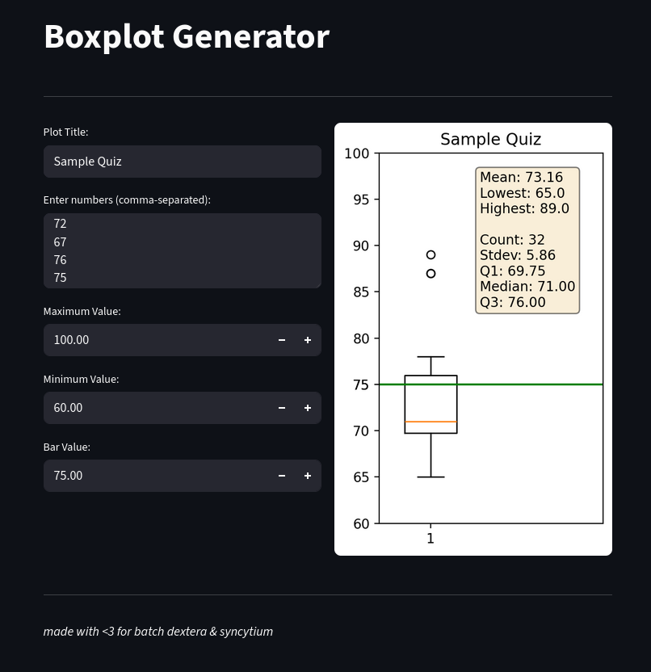

# Streamlit Boxplot Generator

This vibe-coded Streamlit application generates boxplots for visualizing data, specifically designed for class reporting of scores. It provides a quick and easy way to create boxplots for data analysis.

License: MIT License